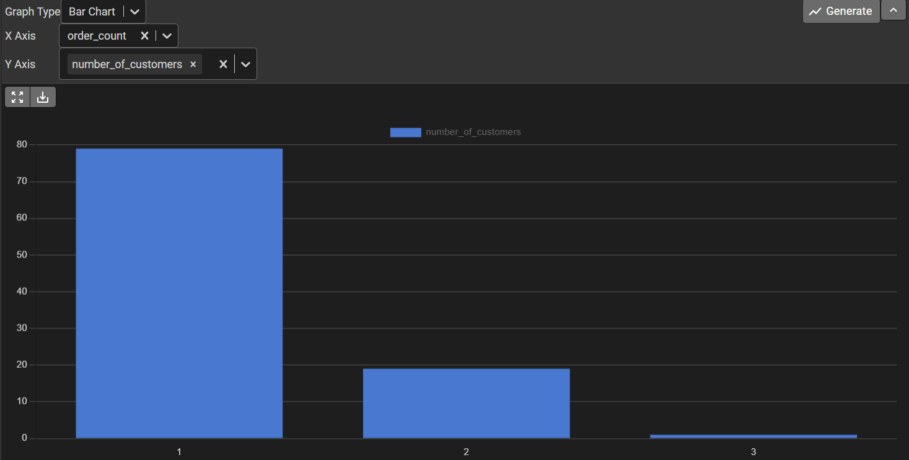
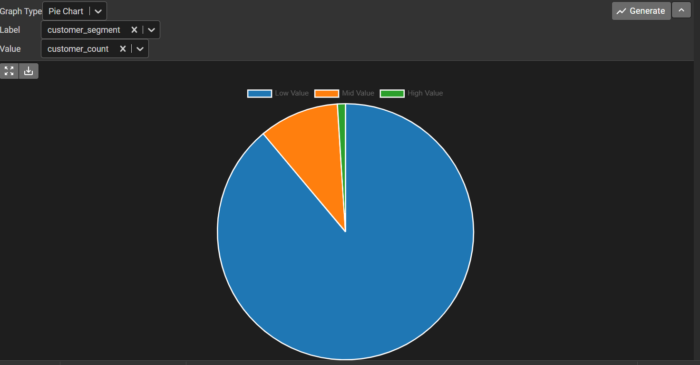
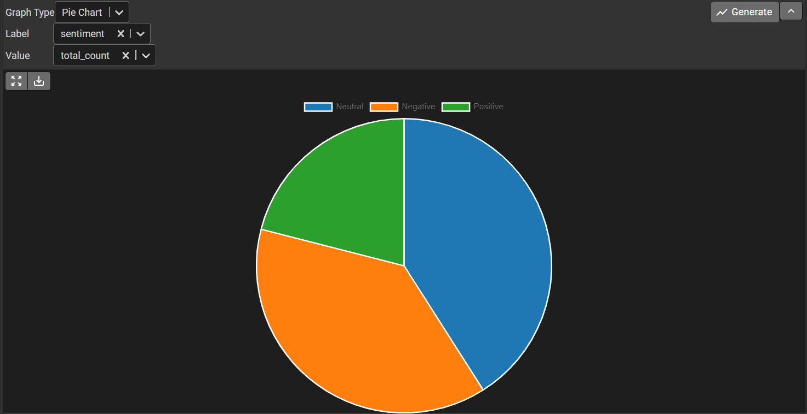
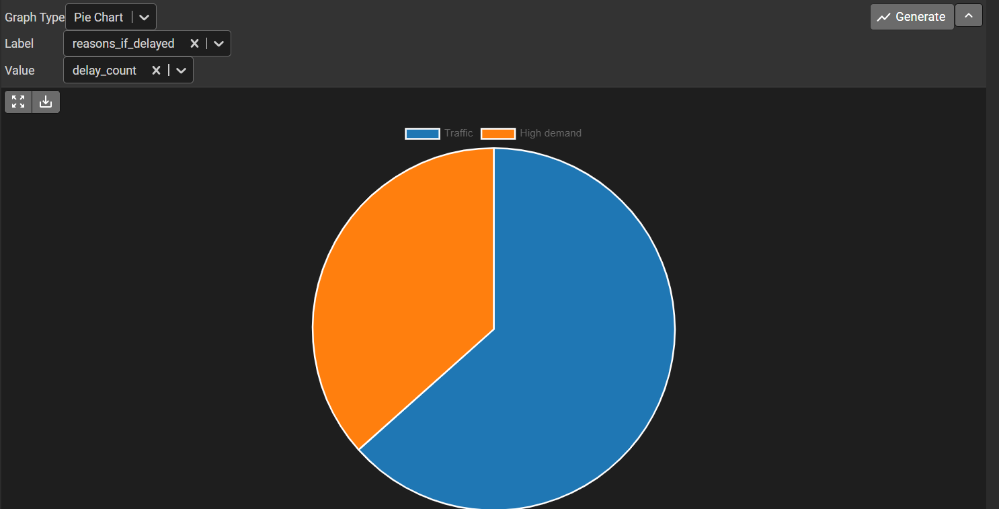
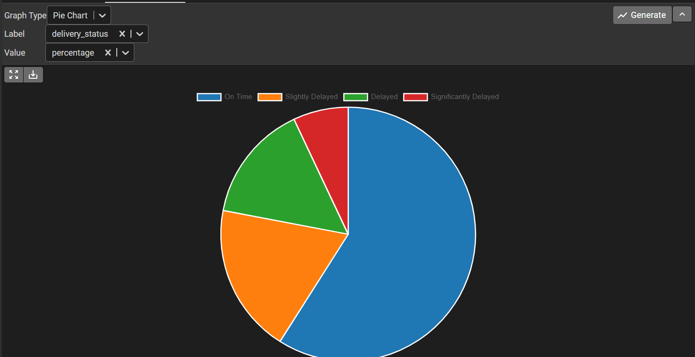
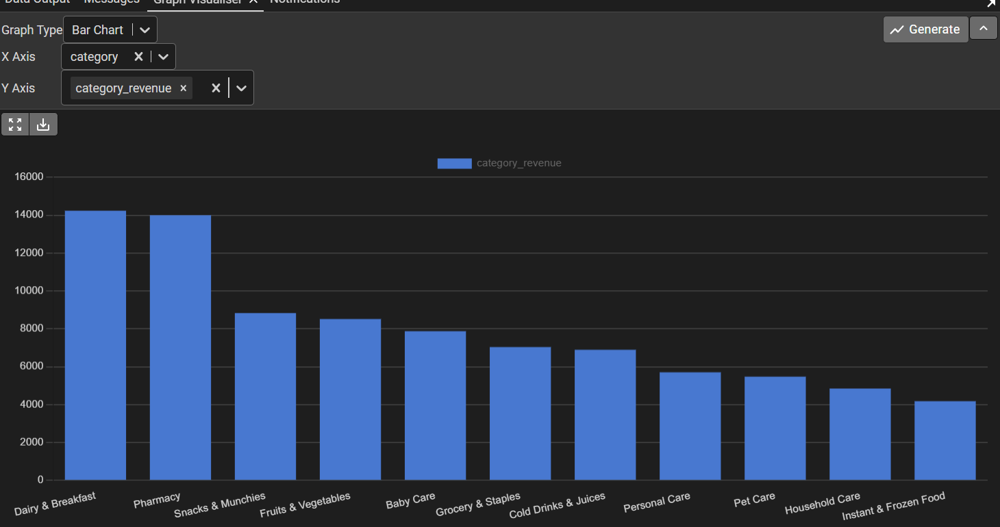

# Blinkit SQL Analysis (PostgreSQL)

End-to-end SQL analysis of a quick-commerce dataset to evaluate customer behavior, revenue trends, delivery performance, and sentiment patterns.

---

# 📌 Project Objective

The goal of this project is to simulate real-world business intelligence analysis for a quick-commerce platform similar to Blinkit.

This analysis focuses on:

- Customer retention & purchase frequency
- Revenue distribution across product categories
- Delivery performance and delay causes
- Customer sentiment patterns
- Spend-based customer segmentation

---

# 🗂 Dataset Overview

The dataset consists of the following relational tables:

- customers
- orders
- order_items
- products
- delivery
- feedback

The analysis was performed using PostgreSQL.

---

# 🛠 Tools Used

- PostgreSQL
- pgAdmin
- GitHub

---

# 📊 Business Analysis & Insights

---

## 1️⃣ Customer Order Distribution



### 🔎 Insights

- The majority of customers placed only **one order (~80%)**.
- Very few customers placed more than two orders.
- This indicates **extremely low customer retention**.
- The platform is heavily dependent on acquiring new customers rather than retaining existing ones.

### 📌 Business Risk

High acquisition dependency increases marketing cost and reduces long-term profitability.

---

## 2️⃣ Customer Segmentation (Spend-Based)



### 🔎 Insights

- Most customers fall into the **Low Value segment**.
- A very small percentage are High Value customers.
- Revenue is likely concentrated among a small group of repeat buyers.

### 📌 Business Opportunity

- Upselling and cross-selling strategies could increase average order value.
- Loyalty programs can help convert Low Value customers into Mid or High Value segments.

---

## 3️⃣ Customer Sentiment Distribution



### 🔎 Insights

- Neutral sentiment dominates customer feedback.
- Negative feedback is significantly high.
- Positive feedback is comparatively lower.

### 📌 Business Interpretation

Customer satisfaction is moderate but not strong.  
Service improvements—especially in delivery and app experience—could significantly improve brand perception.

---

## 4️⃣ Delivery Delay Reasons



### 🔎 Insights

- Traffic is the primary reason for delays.
- High demand is the secondary contributor.

### 📌 Operational Insight

The business could improve performance by:

- Optimizing delivery routing
- Expanding micro-fulfillment centers
- Managing peak-hour demand more effectively

---

## 5️⃣ Delivery Status Breakdown



### 🔎 Insights

- Around 60% of deliveries are On Time.
- The remaining share includes Slightly Delayed, Delayed, and Significantly Delayed orders.
- Delay rate is not negligible for a quick-commerce model.

### 📌 Business Impact

Delivery delays directly influence customer sentiment and repeat purchase probability.

Reducing delays can improve both retention and customer satisfaction.

---

## 6️⃣ Category Revenue Performance



### 🔎 Insights

- Dairy & Breakfast is the highest revenue-generating category.
- Pharmacy is the second highest.
- Revenue is concentrated in essential daily-use products.
- Long-tail categories contribute significantly less.

### 📌 Strategic Insight

The business is highly dependent on essential goods.

Opportunities exist to:
- Promote underperforming categories
- Bundle high-demand and low-demand products
- Increase basket size through strategic cross-selling

---

# 🧠 Key Strategic Takeaways

- Customer retention is the biggest challenge.
- Revenue is concentrated among low-spend customers.
- Delivery delays impact customer satisfaction.
- Essential goods dominate revenue share.
- Operational optimization could directly improve profitability.

---

# 📈 Advanced SQL Concepts Used

- GROUP BY & HAVING
- Subqueries
- Aggregations (SUM, COUNT, AVG)
- CASE statements
- JOIN operations
- Window functions

---

# 📂 Project Structure

```
data/        → Raw CSV files  
queries/     → SQL scripts  
visuals/     → Analysis charts  
README.md    → Documentation  
```

---

# 👤 Author

Devarun Bharadwaj  
MSc Molecular & Cellular Biology  
Transitioning into Data Analytics  

---

